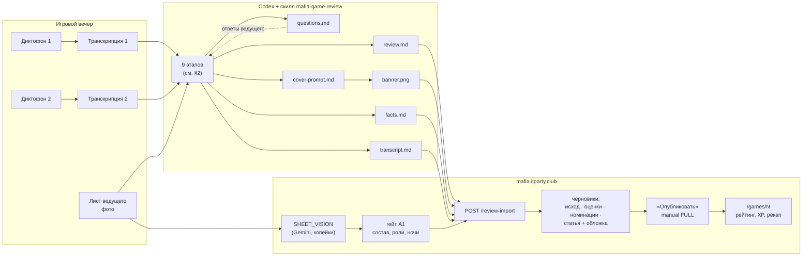

# Архитектура: как скилл заменяет конвейер и как сервис принимает результат

## 1. Место в системе



Раньше между столом и публикацией стоял платный конвейер из 12 модельных шагов
(~100–150 THB на партию). Теперь модельную работу делает Codex на подписке владельца, а
сервису остаётся дешёвое распознавание листа и вся механика публикации: контракт
неизменности, ledger, рейтинг, рассылка.

## 2. Девять этапов скилла и что им соответствует в конвейере

| Этап скилла | Шаг конвейера | Вход → выход | Опора в `references/` |
|---|---|---|---|
| 1. Лист → каркас фактов | SHEET_VISION, A1 | фото/текст листа → состав, роли, ночи, дни | `host-sheet-example.md`, `host-sheet-legend.md`, `host-answers.md`, `prompts/sheet_vision.v1.md` |
| 2. Две дорожки → расшифровка | TRANSCRIBE, STITCH, HOST_ID, TRANSCRIPT_POLISH | транскрипции → `transcript.md` | `prompts/transcribe.v3.md`, `host_id.v3.md`, `transcript_polish.v1.md`, `pipeline-and-pitfalls.md` §2 |
| 3. События ведущего и фазы | HOST_EVENTS, PHASE_RECON | реплики ведущего → события, дни/ночи | `prompts/host_events.v7.md`, `phase_recon.v3.md`, `schemas/event_draft_set.v1.json` |
| 4. Заявления игроков | CLAIMS | речь по кругам → заявления с целями | `prompts/claims.v2.md`, `schemas/claim_set.v1.json` |
| 5. Сверка листа с записью → **стоп** | RULE_SIMULATOR, гейт A2 | `facts.md` (состав, ночи по листу, хронология по записи) + конфликты → `questions.md` → ответы ведущего | `templates/facts.md`, `code/scoring.py::build_timeline`, `templates/questions.md` |
| 6. Оценки и номинации | JUDGE + формула | факты + заявления → сигналы → `scripts/score_review.py` → оценки и кандидаты | `scoring.md` §4a, `scripts/score_review.py`, `prompts/judge.v6.md` |
| 7. Статья | STORY, FACT_CHECK | данные + аналитика → разделы статьи, самопроверка | `article-style.md`, `code/article.py`, `prompts/story.v6.md`, `fact_check.v3.md` |
| 8. Обложка | COVER | хронология → бриф → промт → `banner.png` | `templates/cover-prompt.md`, `prompts/cover.v3.md`, `code/cover_brief.py` |
| 9. Выходы и чек-лист | EDITORIAL_REVIEW | комплект → `scripts/validate_review_bundle.py` → загрузка | `scripts/validate_review_bundle.py`, `review-import-contract.md`, `templates/review.md` |

Две остановки с человеком — те же, что гейты конвейера: **A1** (состав и роли — только по
листу) и **A2** (расхождения листа и записи решает ведущий, не агент).

## 3. Принципы, перенесённые из конвейера

- **Иерархия источников.** Роли и ночные ходы — только лист. Публичные события — реплики
  ведущего. Речь игроков — заявления, не факты. «Я комиссар» — факт речи, не роли.
- **Право на факт даёт доказательство**, а не источник: у события есть реплика, у хода —
  клетка листа, у сигнала оценки — заявление того же игрока.
- **Модель против листа — вопрос ведущему; модель против самой себя — нормализация.**
- **Оценку считает формула, разбор поставляет наблюдения.** `score = clamp(base + delta)`,
  `delta = clamp(raw × 0.5, ±3) × n/(n+2)`; базы — по листу и исходу; оценка есть у каждого
  игрока состава. Номинации — только из кандидатов по метрикам.
- **Половина статьи — данные, не текст.** Состав, ночи, хронология собираются из листа и
  фактов сухо и полно; аналитика — сводка, абзацы фаз, «что решило игру», ходы, итог.
- **Не додумывать.** Подтверждено / вероятно / не удалось установить; хеджи — буквальным
  словарём проверки; дословные цитаты запрещены; имена только из состава.

## 4. Контракт `review.md` (что парсит сервис)

```
# Название                       ← 3–7 слов, без даты и номера
лид                              ← первый абзац
## Исход                         ← данные: «Победили: …» + таблица № | Игрок | Роль | Финальная роль | Итог
## Состав стола … ## Итог        ← текст статьи: ##/### заголовки, - пункты, > примечания, абзацы
## Оценки игроков                ← данные: таблица пяти навыков + комментарий, у каждого места
## Номинации                     ← данные: до трёх «- 🔎 **Название** — №N Имя. Причина.»
## Обложка / Вопросы ведущему    ← пропускаются
```

Сервис на импорте (одна транзакция, иначе всё откатывается):

1. если A1 не подтверждён — строит состав по последнему распознанному листу, сверяет с
   файлом место за местом (место, стартовая роль, имя), недостающих игроков заводит с
   листа, сохраняет A1 с ночными ходами листа и снимает зависший прогон; расхождение →
   400 с перечнем, ведущий подтверждает A1 руками;
2. не даёт файлу подделать победителей (колонка «Итог» сверяется со стороной) и роли
   (переходы только по своду: свидетель → комиссар/доктор, оборотень → мафия, жулик → любая);
3. пишет черновики: исход (переиспользует совпадающий), ручные оценки (у всех или отказ),
   номинации (всегда из файла), статью с обложкой (байты обложки — в БД, под бэкапом;
   публично отдаётся только после публикации);
4. ничего не публикует — это делает кнопка «Опубликовать»: снимки видимости, оценок,
   номинаций, ledger, рейтинг, рекап в группу.

`facts.md` сервис читает как арбитра: если Gemini прочёл роль места иначе, чем `review.md`,
а таблица «Состав A1» в `facts.md` согласна с файлом — принимается файл; таблица «Ночные
действия по листу» даёт ночные ходы в A1, если ведущий подтвердил состав без них.
`transcript.md` хранится рядом с партией как её расшифровка (в альтернативном пути аудио в
сервис не попадает). Оба файла видны только персоналу.

Полный контракт — `references/review-import-contract.md`.

## 5. Файловая карта и синхронизация

```
SKILL.md                      алгоритм, канон фаз, маршрут чтения references (читает Codex)
ARCHITECTURE.md               этот документ
scripts/
  score_review.py             оценки и кандидаты номинаций по формуле клуба (stdlib)
  validate_review_bundle.py   проверка комплекта до загрузки в сервис (stdlib)
references/
  rules.md                    свод правил клуба (генерируется из rule_set_v1.json сервиса)
  host-sheet-example.md       схема бланка, обезличенный пример, легенда знаков, уточнения ведущего
  host-sheet-legend.md        канон бланка листа
  host-questions.md           закрытые вопросы по листу
  host-answers.md             ответы ведущего по правилам, листу, номинациям
  pipeline-and-pitfalls.md    конвейер и грабли живых прогонов
  article-style.md            форма и стиль статьи
  scoring.md                  формула оценок (читаемо)
  article-quality-journal.md  журнал сравнений с эталонами
  review-import-contract.md   контракт импорта (копия docs/12 сервиса)
  prompts/*.md                активные промты конвейера дословно
  schemas/*.json              схемы ответов шагов
  code/*.py                   scoring / article / cover_brief / rating / story как есть
templates/
  review.md                   контракт на вымышленных именах (парсится тестом сервиса)
  facts.md                    контракт facts.md (состав, ночные ходы — парсится сервисом)
  questions.md · transcript.md · cover-prompt.md
```

Источник — `skills/codex/mafia-game-review/` в репозитории сервиса; там же тесты, которые
держат промты и шаблон в согласии с кодом. Публичный репозиторий обновляется копией.
