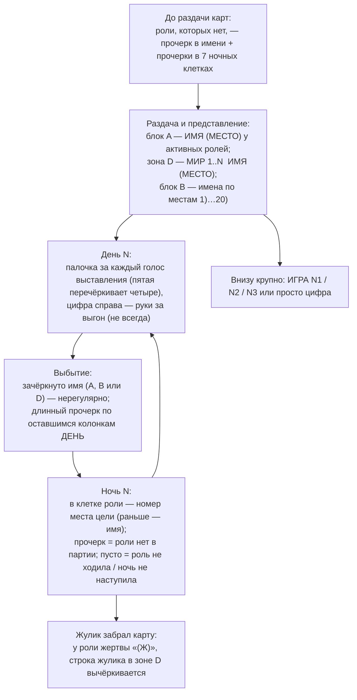

# Лист ведущего: схема бланка, обезличенный пример и как его читать

Дополнение к `host-sheet-legend.md` (канон бланка v1 «MAFIA PATTAYA FOXX») и
`host-questions.md` (ответы ведущего Саши, 24.08.2026). Здесь — то же самое глазами: как
выглядит лист, как ведущий его заполняет по ходу партии, что значит каждый знак и как из
него получаются таблицы `facts.md`. Имена — вымышленные, те же, что в `templates/`.

## 1. Схема бланка (A4, портрет)

```
┌──────────────────────────────── MAFIA PATTAYA FOXX ────────────────────────────────┐
│ Блок A  «РОЛИ НА ИГРУ»                 │ Блок B  «ГОЛОСОВАНИЕ»                      │
│ ┌────────────┬───────────────┐         │ ┌───┬────────────┬──────┬──────┬──…──┬──────┐ │
│ │ РОЛЬ       │ ИМЯ ИГРОКА    │         │ │ № │ ИМЯ        │ДЕНЬ 1│ДЕНЬ 2│ …   │ДЕНЬ 7│ │
│ ├────────────┼───────────────┤         │ ├───┼────────────┼──────┼──────┼──…──┼──────┤ │
│ │ ДОН МАФИИ  │ (от руки)     │         │ │1) │            │      │      │     │      │ │
│ │ МАФИЯ 1    │               │         │ │2) │            │      │      │     │      │ │
│ │ МАФИЯ 2    │               │         │ │…  │  до 20)    │      │      │     │      │ │
│ │ МАФИЯ 3    │               │         │ └───┴────────────┴──────┴──────┴──…──┴──────┘ │
│ │ МАНЬЯК     │               │         │  палочки = голоса выставления,               │
│ │ НАГНЕТАТЕЛЬ│               │         │  цифра справа = руки за выгон (не всегда)     │
│ │ ОБОРОТЕНЬ  │               │         │                                              │
│ │ КОМИССАР   │               │         │                                              │
│ │ ДОКТОР     │               │         │                                              │
│ │ НАСЛЕДНИК  │  (= свидетель)│         │                                              │
│ │ КАМИКАДЗЕ  │               │         │                                              │
│ │ МИРНЫЕ     │  (не заполн.) │         │                                              │
│ └────────────┴───────────────┘         │                                              │
│ Зона D (от руки):                      │                                              │
│   МИР 1  ИМЯ (место)                   │                                              │
│   МИР 2  ИМЯ (место)   …               │                                              │
│   [дописанные роли: ЖУЛИК …]           │                                              │
│                                        │                                              │
│   ИГРА N2        ← номер партии, крупно│                                              │
├────────────────────────────────────────┴──────────────────────────────────────────────┤
│ Блок C  «НОЧНЫЕ СОБЫТИЯ»                                                              │
│ ┌────────────┬───────┬───────┬───────┬───────┬───────┬───────┬───────┐                │
│ │ РОЛЬ       │НОЧЬ 1 │НОЧЬ 2 │НОЧЬ 3 │НОЧЬ 4 │НОЧЬ 5 │НОЧЬ 6 │НОЧЬ 7 │                │
│ ├────────────┼───────┼───────┼───────┼───────┼───────┼───────┼───────┤                │
│ │ МАФИЯ      │ цель  │       │       │       │       │       │       │ ← в кого стреляли│
│ │ ДОН МАФИИ  │       │       │       │       │       │       │       │ ← кого проверил │
│ │ МАНЬЯК     │       │       │       │       │       │       │       │ ← в кого стрелял│
│ │ НАГНЕТАТЕЛЬ│       │       │       │       │       │       │       │ ← кого проклял  │
│ │ КОМИССАР   │       │       │       │       │       │       │       │ ← кого проверил │
│ │ ДОКТОР     │       │       │       │       │       │       │       │ ← кого лечил    │
│ └────────────┴───────┴───────┴───────┴───────┴───────┴───────┴───────┘                │
└───────────────────────────────────────────────────────────────────────────────────────┘
```

Важно про блок C: **порядок строк не совпадает с порядком пробуждения** (МАФИЯ напечатана
выше ДОН МАФИИ) — читать строки по подписи, не по позиции. Порядок ночи задаёт свод
правил: босс → мафия → маньяк → нагнетатель → комиссар → доктор.

## 2. Как ведущий заполняет лист по ходу партии



## 3. Обезличенный пример заполненного листа

Партия из шаблонов скилла: 8 игроков, 3 ночи, победа красных. Так лист выглядит после
партии (зачёркивание показано `~~так~~`, палочки — `|`, пятёрка — `卌`).

**Блок A — роли на игру**

| РОЛЬ ИГРОКА | ИМЯ ИГРОКА |
|---|---|
| ДОН МАФИИ | ~~ВЛАД (5)~~ |
| МАФИЯ 1 | ~~ГОША (4)~~ |
| МАФИЯ 2 | — |
| МАФИЯ 3 | — |
| МАНЬЯК | ДИНА (7) |
| НАГНЕТАТЕЛЬ | — |
| ОБОРОТЕНЬ | — |
| КОМИССАР | ~~МАРК (2)~~ |
| ДОКТОР | ЛИКА (6) |
| НАСЛЕДНИК | СОНЯ (3) |
| КАМИКАДЗЕ | — |
| МИРНЫЕ | *(пусто — мирные в зоне D)* |

**Зона D**

```
МИР 1  АРТЁМ (1)
МИР 2  ~~ПЁТР (8)~~

      ИГРА N1
```

**Блок B — голосование** (первые четыре дня; остальные пусты)

| № | ИМЯ | ДЕНЬ 1 | ДЕНЬ 2 | ДЕНЬ 3 | ДЕНЬ 4 |
|---|---|---|---|---|---|
| 1) | АРТЁМ | `\|` | `\|\|` | | |
| 2) | ~~МАРК~~ | `\|` | | | — |
| 3) | СОНЯ | | | `\|\|\|` | |
| 4) | ~~ГОША~~ | `\|\|` | `卌\|  ] 6` | — | — |
| 5) | ~~ВЛАД~~ | | `\|` | `卌  ] 6` | — |
| 6) | ЛИКА | | | | |
| 7) | ДИНА | `\|\|\|` | | `\|` | `\|\|\|  ] 3` |
| 8) | ~~ПЁТР~~ | — | — | — | — |

Читается так: день 1 — выставляли №1, №2, №4, №7 (у №7 три голоса — он на оправдании,
но стол в первый день никого не вывел: цифры рук нет ни у кого); день 2 — у №4 шесть
голосов и «6» справа — шесть рук за выгон, вышел №4; день 3 — вышел №5 (пять голосов,
шесть рук); день 4 — вышел №7 (три голоса, три руки). Прочерки у №8 с первого дня —
выбыл до первого голосования (убит в ночь 1); у №2 прочерк с четвёртого дня — выбыл
после ночи 3.

**Блок C — ночные события** (номера мест; ночи 4–7 пустые, партия до них не дошла)

| РОЛЬ | НОЧЬ 1 | НОЧЬ 2 | НОЧЬ 3 | НОЧЬ 4 … 7 |
|---|---|---|---|---|
| МАФИЯ | 1 | 2 | *(пусто)* | |
| ДОН МАФИИ | 2 | 3 | *(пусто)* | |
| МАНЬЯК | 8 | 4 | 2 | |
| НАГНЕТАТЕЛЬ | — | — | — | — — — — |
| КОМИССАР | 4 | 5 | 7 | |
| ДОКТОР | 1 | 2 | 1 | |

Строка НАГНЕТАТЕЛЬ зачёркнута целиком, прочерки во всех семи клетках — роли в партии нет.
Пустые клетки МАФИЯ/ДОН в ночь 3 — не прочерк: роли были в партии, но к ночи 3 их карты
выбыли, ходить некому. Строка ОБОРОТЕНЬ/КАМИКАДЗЕ в блоке C не печатается — эти роли ночью
не ходят.

## 4. Расшифровка примера → таблицы `facts.md`

Состав A1 (место — из скобки в блоке A и зоны D, роль — по строке; НАСЛЕДНИК = свидетель):

| № | Имя/ник на листе | Стартовая роль |
|---|---|---|
| 1 | Артём | мирный |
| 2 | Марк | комиссар |
| 3 | Соня | свидетель |
| 4 | Гоша | мафия |
| 5 | Влад | босс |
| 6 | Лика | доктор |
| 7 | Дина | маньяк |
| 8 | Пётр | мирный |

Ночные действия (клетка → «глагол роли №цель»; прочерк → «не применимо: роли нет»;
пустая клетка у роли, чья карта уже выбыла → «не применимо: … выбыл»):

| Ночь | Босс | Мафия | Маньяк | Комиссар | Доктор |
|---|---|---|---|---|---|
| 1 | проверка №2 | выстрел №1 | выстрел №8 | проверка №4 | лечение №1 |
| 2 | проверка №3 | выстрел №2 | выстрел №4 | проверка №5 | лечение №2 |
| 3 | не применимо: босс выбыл | не применимо: мафии нет | выстрел №2 | проверка №7 | лечение №1 |

Что лист **не** говорит и что надо брать из записи или спрашивать у ведущего:
- кто погиб ночью, а кого спас доктор — лист даёт только цели; результат («доктор
  остановил выстрел») выводится сопоставлением клеток МАФИЯ/МАНЬЯК и ДОКТОР и
  подтверждается утренним объявлением в записи;
- кого стол вывел днём — по цифре рук и прочеркам, но объявление ведущего в записи
  первично; при расхождении — вопрос ведущему;
- причина выбытия (ночь/день) — лист не различает;
- переходы карт (свидетель → комиссар) — лист не отмечает, кроме случая жулика «(Ж)».

## 5. Условные знаки — сводная легенда

| Знак | Где | Значение |
|---|---|---|
| `ИМЯ (7)` | A, D | имя как на листе и **номер места** — связь блоков только по номеру |
| `—` в клетке имени + зачёркнутый ярлык | A | роли нет в партии |
| имя при зачёркнутом ярлыке / зачёркнутое имя | A, B, D | игрок выбыл (ставится нерегулярно) |
| незачёркнутое имя | A, B, D | **нет данных**, не «жив» |
| `\|`, `\|\|`, `卌` | B | голоса выставления в круге речей |
| цифра справа от палочек (`卌\| ] 6`) | B | руки за выгон на выголосовывании; нет цифры = неизвестно, не ноль |
| `+` в клетке дня | B | отдельного знака нет — «наверное, просто палочка»; при сомнении — нечитаемо |
| длинный прочерк по колонкам ДЕНЬ | B | игрок выбыл, в дальнейших голосованиях не участвует |
| пустая колонка ДЕНЬ 1 | B | стол в первый день не голосовал — легально |
| номер (раньше — имя, часто сокращённое) в клетке ночи | C | цель хода роли |
| `—` в клетке ночи (все 7 клеток) | C | роли нет в партии |
| пустая клетка ночи | C | роль не ходила / карта выбыла / ночь не наступила |
| зачёркнутая строка роли | C | роли нет в партии |
| `НАСЛЕДНИК` | A | **свидетель** (карты «наследник» в колоде нет) |
| `(Ж)` у роли | A, D | карту забрал жулик; строка жулика в зоне D вычёркивается |
| `ИГРА N2` / `2` внизу | D | номер партии за вечер |
| палочки слева от дневных событий | поля | фолы (по ответу ведущего; отдельного блока нет) |

## 6. Уточнения ведущего (Саша, 24.08.2026) — что применять при чтении

- **Мирные** пишутся столбиком в зоне D под блоком ролей, строка «МИРНЫЕ» в блоке A не
  заполняется; в новом шаблоне строки «МИР 1..N» печатные (HS-1).
- **Зачёркивание выбывшего** делается нерегулярно: «могу забыть… по записи игры будет
  понятно, кто выбыл». Живой состав — по записи и симуляции, не по зачёркиваниям (HS-2).
- **Жулик забрал карту**: у роли жертвы в скобках «Ж» («жулик стал этой картой»), строка
  жулика вычёркивается (HS-4).
- **Бланк**: 7 колонок ДЕНЬ и 7 колонок НОЧЬ (HS-5).
- **Цифра рядом с палочками — руки за выгон**: палочки — голоса выставления в 30-секундных
  речах, цифра справа — сколько рук подняли; «делаю не всегда» ⇒ нет цифры = неизвестно (HS-7).
- **Знак «+»** — отдельного знака нет, «наверное, просто палочка» (HS-8).
- **Играют по номеркам**: впредь номер места и в ролях, и в ночных событиях («у нас будет
  всё по номерам»); на старых листах в ночах — только имена, часто сокращённые
  (`АМБ`, `8ТОКИ`) — резолв по составу, неоднозначность → вопрос ведущему, не догадка (HS-9).
- **Порядок пробуждения** зависит от режима партии («если в закрытую — дон вторым»);
  задаётся сводом правил, лист его не фиксирует (HS-6 — единственный открытый).
- **Как ведущий сам читает лист** (`host-answers.md` §3.1): палочки — голоса выставления;
  «стрелки» рядом с именами — скорее всего зачёркивания выбывших; цифры — руки за выгон;
  отдельная цифра внизу — номер партии; фолы — палочками слева от дневных событий;
  отдельно помечать, кто выбыл днём, ведущий не считает нужным.
- **Свидетель вместо наследника**: в новом шаблоне «наследник» переименован в «свидетеля»,
  добавлен жулик (HS §3.2).

## 7. Типовые грабли при чтении фото

- Прочитать блок C по позиции строк (МАФИЯ над ДОНОМ) — цели босса и мафии меняются
  местами. Только по подписи.
- Принять незачёркнутое имя за живого — ведущий зачёркивает не всех.
- Счесть отсутствие цифры рук нулём рук — это «не записано».
- Связать блоки A и B по имени — на листе бывают сокращения и одинаковые имена; связь
  только по номеру места в скобках.
- Сосчитать ночи по числу колонок (всегда 7) — число ночей партии = число ночей с
  хотя бы одним заполненным ходом (или явной пометкой «нечитаемо»).
- Записать в события то, чего ведущий не объявлял в записи, «потому что так на листе» —
  клетка листа даёт ход, событие партии даёт только объявление ведущего.
